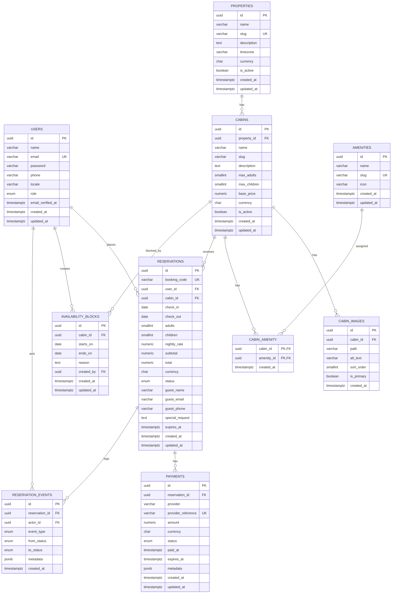
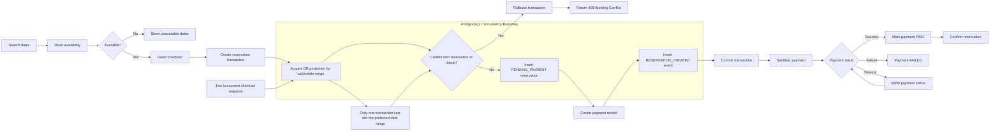
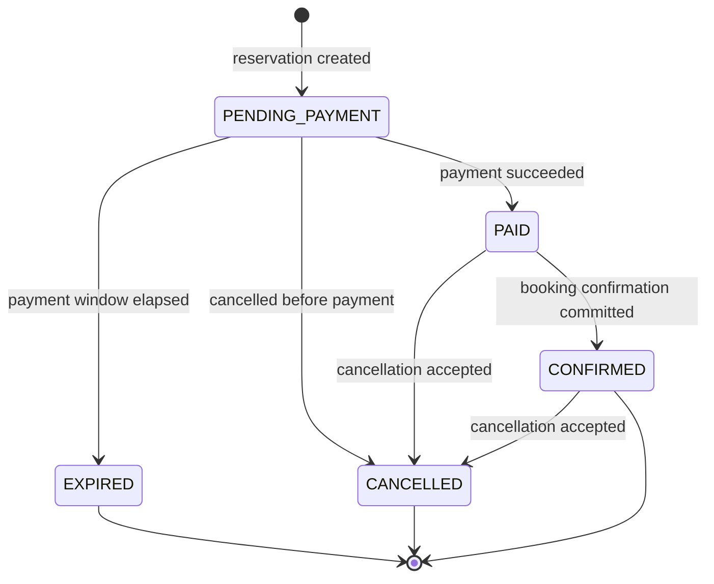
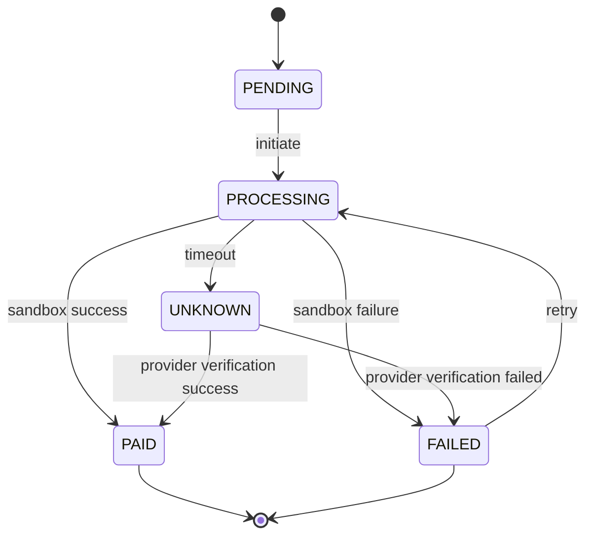

# Technical Design — Villa Dieng

**Status:** Technical Architecture Specification  
**Stack:** Laravel REST API + React/Vite + PostgreSQL + Redis  
**Primary database:** PostgreSQL  
**Booking model:** Per-night cabin reservation  
**MVP inventory:** 1 cabin or several identical cabins  
**Payment:** Sandbox  
**Source of truth for availability:** PostgreSQL

---

# 1. Architecture Overview

```text
PostgreSQL
├── users
├── properties
│   └── cabins
│       ├── cabin_images
│       └── cabin_amenity
│           └── amenities
├── reservations
│   ├── payments
│   └── reservation_events
└── availability_blocks
```

## Core principles

- UUID sebagai public identifier.
- `NUMERIC(12,2)` untuk monetary values.
- `DATE` untuk check-in/check-out.
- `TIMESTAMPTZ` untuk event, payment, dan audit timestamps.
- PostgreSQL menjadi source of truth untuk availability.
- PostgreSQL `daterange` + GiST exclusion constraint menjadi enforcement layer anti-double-booking.
- Redis digunakan untuk cache, queue, rate limiting, dan kebutuhan ephemeral; bukan sebagai source of truth inventory.
- Transactional data tidak menggunakan soft delete.
- Harga pada reservation disimpan sebagai snapshot agar perubahan harga tidak mengubah booking lama.

---

# 2. PostgreSQL Extensions

```sql
CREATE EXTENSION IF NOT EXISTS pgcrypto;
CREATE EXTENSION IF NOT EXISTS btree_gist;
CREATE EXTENSION IF NOT EXISTS citext;
```

### Alasan

- `pgcrypto`: menyediakan `gen_random_uuid()`.
- `btree_gist`: diperlukan untuk exclusion constraint kombinasi `cabin_id` + `daterange`.
- `citext`: email case-insensitive tanpa perlu normalisasi manual pada query.

---

# 3. PostgreSQL Enums

```sql
CREATE TYPE user_role AS ENUM (
    'guest',
    'admin'
);

CREATE TYPE reservation_status AS ENUM (
    'pending_payment',
    'paid',
    'confirmed',
    'expired',
    'cancelled'
);

CREATE TYPE payment_status AS ENUM (
    'pending',
    'processing',
    'paid',
    'failed',
    'unknown',
    'expired'
);

CREATE TYPE reservation_event_type AS ENUM (
    'created',
    'payment_initiated',
    'payment_succeeded',
    'payment_failed',
    'confirmed',
    'expired',
    'cancelled',
    'availability_blocked',
    'availability_unblocked'
);
```

`available` tidak dibuat sebagai reservation status karena availability adalah hasil kalkulasi inventory, bukan state reservation.

---

# 4. Database Schema

## 4.1 `users`

```sql
CREATE TABLE users (
    id UUID PRIMARY KEY DEFAULT gen_random_uuid(),

    name VARCHAR(120) NOT NULL,

    email CITEXT NOT NULL UNIQUE,

    password VARCHAR(255),

    phone VARCHAR(30),

    locale VARCHAR(5) NOT NULL DEFAULT 'id'
        CHECK (locale IN ('id', 'en')),

    role user_role NOT NULL DEFAULT 'guest',

    email_verified_at TIMESTAMPTZ,

    created_at TIMESTAMPTZ NOT NULL DEFAULT NOW(),
    updated_at TIMESTAMPTZ NOT NULL DEFAULT NOW()
);

CREATE INDEX idx_users_role
ON users(role);
```

### Design rationale

`password` nullable karena guest checkout tidak boleh dipaksa membuat password sebelum reservation.

Account dapat dibuat ketika guest checkout:

```text
Guest checkout
      ↓
Find/create user
      ↓
Create reservation
      ↓
Send account setup / password creation flow
```

---

## 4.2 `properties`

```sql
CREATE TABLE properties (
    id UUID PRIMARY KEY DEFAULT gen_random_uuid(),

    name VARCHAR(150) NOT NULL,

    slug VARCHAR(180) NOT NULL UNIQUE,

    description TEXT,

    timezone VARCHAR(50) NOT NULL DEFAULT 'Asia/Jakarta',

    currency CHAR(3) NOT NULL DEFAULT 'IDR'
        CHECK (currency = UPPER(currency)),

    is_active BOOLEAN NOT NULL DEFAULT TRUE,

    created_at TIMESTAMPTZ NOT NULL DEFAULT NOW(),
    updated_at TIMESTAMPTZ NOT NULL DEFAULT NOW()
);

CREATE INDEX idx_properties_active
ON properties(is_active);
```

### Design rationale

Walaupun MVP hanya memiliki satu property, entity ini dipertahankan agar sistem dapat berkembang menjadi multi-property tanpa migrasi arsitektur besar.

---

## 4.3 `cabins`

```sql
CREATE TABLE cabins (
    id UUID PRIMARY KEY DEFAULT gen_random_uuid(),

    property_id UUID NOT NULL,

    name VARCHAR(150) NOT NULL,

    slug VARCHAR(180) NOT NULL,

    description TEXT,

    max_adults SMALLINT NOT NULL
        CHECK (max_adults > 0),

    max_children SMALLINT NOT NULL DEFAULT 0
        CHECK (max_children >= 0),

    base_price NUMERIC(12,2) NOT NULL
        CHECK (base_price >= 0),

    currency CHAR(3) NOT NULL DEFAULT 'IDR',

    is_active BOOLEAN NOT NULL DEFAULT TRUE,

    created_at TIMESTAMPTZ NOT NULL DEFAULT NOW(),
    updated_at TIMESTAMPTZ NOT NULL DEFAULT NOW(),

    CONSTRAINT fk_cabins_property
        FOREIGN KEY (property_id)
        REFERENCES properties(id)
        ON DELETE RESTRICT,

    CONSTRAINT uq_cabins_property_slug
        UNIQUE (property_id, slug)
);

CREATE INDEX idx_cabins_property_active
ON cabins(property_id, is_active);
```

### Design rationale

`property_id + slug` unique memungkinkan slug yang sama digunakan pada property berbeda.

---

## 4.4 `cabin_images`

```sql
CREATE TABLE cabin_images (
    id UUID PRIMARY KEY DEFAULT gen_random_uuid(),

    cabin_id UUID NOT NULL,

    path VARCHAR(500) NOT NULL,

    alt_text VARCHAR(255),

    sort_order SMALLINT NOT NULL DEFAULT 0
        CHECK (sort_order >= 0),

    is_primary BOOLEAN NOT NULL DEFAULT FALSE,

    created_at TIMESTAMPTZ NOT NULL DEFAULT NOW(),

    CONSTRAINT fk_cabin_images_cabin
        FOREIGN KEY (cabin_id)
        REFERENCES cabins(id)
        ON DELETE CASCADE
);

CREATE INDEX idx_cabin_images_cabin_order
ON cabin_images(cabin_id, sort_order);

CREATE UNIQUE INDEX uq_cabin_primary_image
ON cabin_images(cabin_id)
WHERE is_primary = TRUE;
```

### Design rationale

Partial unique index memastikan hanya satu image menjadi primary image untuk setiap cabin.

---

## 4.5 `amenities`

```sql
CREATE TABLE amenities (
    id UUID PRIMARY KEY DEFAULT gen_random_uuid(),

    name VARCHAR(100) NOT NULL,

    slug VARCHAR(120) NOT NULL UNIQUE,

    icon VARCHAR(100),

    created_at TIMESTAMPTZ NOT NULL DEFAULT NOW(),
    updated_at TIMESTAMPTZ NOT NULL DEFAULT NOW()
);
```

---

## 4.6 `cabin_amenity`

```sql
CREATE TABLE cabin_amenity (
    cabin_id UUID NOT NULL,

    amenity_id UUID NOT NULL,

    created_at TIMESTAMPTZ NOT NULL DEFAULT NOW(),

    PRIMARY KEY (cabin_id, amenity_id),

    CONSTRAINT fk_cabin_amenity_cabin
        FOREIGN KEY (cabin_id)
        REFERENCES cabins(id)
        ON DELETE CASCADE,

    CONSTRAINT fk_cabin_amenity_amenity
        FOREIGN KEY (amenity_id)
        REFERENCES amenities(id)
        ON DELETE RESTRICT
);

CREATE INDEX idx_cabin_amenity_amenity
ON cabin_amenity(amenity_id);
```

---

# 5. Reservations

## 5.1 `reservations`

```sql
CREATE TABLE reservations (
    id UUID PRIMARY KEY DEFAULT gen_random_uuid(),

    booking_code VARCHAR(30) NOT NULL UNIQUE,

    user_id UUID NOT NULL,

    cabin_id UUID NOT NULL,

    check_in DATE NOT NULL,

    check_out DATE NOT NULL,

    adults SMALLINT NOT NULL
        CHECK (adults > 0),

    children SMALLINT NOT NULL DEFAULT 0
        CHECK (children >= 0),

    nightly_rate NUMERIC(12,2) NOT NULL
        CHECK (nightly_rate >= 0),

    subtotal NUMERIC(12,2) NOT NULL
        CHECK (subtotal >= 0),

    total NUMERIC(12,2) NOT NULL
        CHECK (total >= 0),

    currency CHAR(3) NOT NULL DEFAULT 'IDR',

    status reservation_status NOT NULL DEFAULT 'pending_payment',

    guest_name VARCHAR(120) NOT NULL,

    guest_email CITEXT NOT NULL,

    guest_phone VARCHAR(30),

    special_request TEXT,

    expires_at TIMESTAMPTZ,

    created_at TIMESTAMPTZ NOT NULL DEFAULT NOW(),

    updated_at TIMESTAMPTZ NOT NULL DEFAULT NOW(),

    CONSTRAINT fk_reservations_user
        FOREIGN KEY (user_id)
        REFERENCES users(id)
        ON DELETE RESTRICT,

    CONSTRAINT fk_reservations_cabin
        FOREIGN KEY (cabin_id)
        REFERENCES cabins(id)
        ON DELETE RESTRICT,

    CONSTRAINT chk_reservation_dates
        CHECK (check_out > check_in),

    CONSTRAINT chk_reservation_expiry
        CHECK (
            status <> 'pending_payment'
            OR expires_at IS NOT NULL
        )
);
```

---

# 6. Anti-Double-Booking Constraint

Ini merupakan constraint terpenting dalam database.

```sql
ALTER TABLE reservations
ADD CONSTRAINT reservations_no_overlap
EXCLUDE USING gist (
    cabin_id WITH =,
    daterange(check_in, check_out, '[)') WITH &&
)
WHERE (
    status IN (
        'pending_payment',
        'paid',
        'confirmed'
    )
);
```

## Mengapa `[)`?

Booking:

```text
10 Dec → 12 Dec
```

direpresentasikan sebagai:

```text
[10 Dec, 12 Dec)
```

Booking berikutnya:

```text
12 Dec → 14 Dec
```

tidak overlap karena check-out booking pertama sama dengan check-in booking berikutnya.

Ini sesuai model per-night accommodation booking.

---

# 7. Reservation Indexes

```sql
CREATE INDEX idx_reservations_cabin_dates
ON reservations(cabin_id, check_in, check_out);

CREATE INDEX idx_reservations_status
ON reservations(status);

CREATE INDEX idx_reservations_user_created
ON reservations(user_id, created_at DESC);

CREATE INDEX idx_reservations_checkin
ON reservations(check_in);

CREATE INDEX idx_reservations_checkout
ON reservations(check_out);

CREATE INDEX idx_reservations_pending_expiry
ON reservations(expires_at)
WHERE status = 'pending_payment';
```

## Availability query

```sql
SELECT 1
FROM reservations
WHERE cabin_id = :cabin_id
  AND status IN (
      'pending_payment',
      'paid',
      'confirmed'
  )
  AND check_in < :requested_check_out
  AND check_out > :requested_check_in
LIMIT 1;
```

Overlap rule:

```text
existing.check_in < requested.check_out
AND
existing.check_out > requested.check_in
```

GiST exclusion constraint menjadi enforcement terakhir; B-tree index membantu query operasional umum.

---

# 8. `payments`

```sql
CREATE TABLE payments (
    id UUID PRIMARY KEY DEFAULT gen_random_uuid(),

    reservation_id UUID NOT NULL,

    provider VARCHAR(50) NOT NULL DEFAULT 'sandbox',

    provider_reference VARCHAR(100) UNIQUE,

    amount NUMERIC(12,2) NOT NULL
        CHECK (amount >= 0),

    currency CHAR(3) NOT NULL DEFAULT 'IDR',

    status payment_status NOT NULL DEFAULT 'pending',

    paid_at TIMESTAMPTZ,

    expires_at TIMESTAMPTZ,

    metadata JSONB NOT NULL DEFAULT '{}'::JSONB,

    created_at TIMESTAMPTZ NOT NULL DEFAULT NOW(),

    updated_at TIMESTAMPTZ NOT NULL DEFAULT NOW(),

    CONSTRAINT fk_payments_reservation
        FOREIGN KEY (reservation_id)
        REFERENCES reservations(id)
        ON DELETE RESTRICT
);

CREATE INDEX idx_payments_reservation
ON payments(reservation_id);

CREATE INDEX idx_payments_status
ON payments(status);

CREATE INDEX idx_payments_provider_reference
ON payments(provider_reference);
```

### Design rationale

Payment dipisahkan dari reservation karena payment memiliki lifecycle, reference, metadata, dan retry semantics sendiri.

---

# 9. `availability_blocks`

```sql
CREATE TABLE availability_blocks (
    id UUID PRIMARY KEY DEFAULT gen_random_uuid(),

    cabin_id UUID NOT NULL,

    starts_on DATE NOT NULL,

    ends_on DATE NOT NULL,

    reason TEXT NOT NULL,

    created_by UUID NOT NULL,

    created_at TIMESTAMPTZ NOT NULL DEFAULT NOW(),

    updated_at TIMESTAMPTZ NOT NULL DEFAULT NOW(),

    CONSTRAINT fk_availability_blocks_cabin
        FOREIGN KEY (cabin_id)
        REFERENCES cabins(id)
        ON DELETE RESTRICT,

    CONSTRAINT fk_availability_blocks_creator
        FOREIGN KEY (created_by)
        REFERENCES users(id)
        ON DELETE RESTRICT,

    CONSTRAINT chk_availability_block_dates
        CHECK (ends_on > starts_on)
);
```

Anti-overlap block:

```sql
ALTER TABLE availability_blocks
ADD CONSTRAINT availability_blocks_no_overlap
EXCLUDE USING gist (
    cabin_id WITH =,
    daterange(starts_on, ends_on, '[)') WITH &&
);
```

Index:

```sql
CREATE INDEX idx_availability_blocks_cabin_dates
ON availability_blocks(cabin_id, starts_on, ends_on);
```

---

# 10. `reservation_events`

Reservation event log bersifat append-only.

```sql
CREATE TABLE reservation_events (
    id UUID PRIMARY KEY DEFAULT gen_random_uuid(),

    reservation_id UUID NOT NULL,

    actor_id UUID,

    event_type reservation_event_type NOT NULL,

    from_status reservation_status,

    to_status reservation_status,

    metadata JSONB NOT NULL DEFAULT '{}'::JSONB,

    created_at TIMESTAMPTZ NOT NULL DEFAULT NOW(),

    CONSTRAINT fk_reservation_events_reservation
        FOREIGN KEY (reservation_id)
        REFERENCES reservations(id)
        ON DELETE CASCADE,

    CONSTRAINT fk_reservation_events_actor
        FOREIGN KEY (actor_id)
        REFERENCES users(id)
        ON DELETE SET NULL
);

CREATE INDEX idx_reservation_events_reservation_created
ON reservation_events(reservation_id, created_at DESC);

CREATE INDEX idx_reservation_events_type
ON reservation_events(event_type);
```

`actor_id` nullable karena event dapat berasal dari:

- customer
- admin
- system
- payment worker
- scheduler

System-generated events dapat menggunakan `NULL`.

---

# 11. Relationship Map

```text
properties
    │
    └──< cabins
          │
          ├──< cabin_images
          │
          ├──< cabin_amenity >── amenities
          │
          ├──< reservations
          │       │
          │       ├──< payments
          │       │
          │       └──< reservation_events
          │
          └──< availability_blocks

users
    │
    ├──< reservations
    ├──< availability_blocks
    └──< reservation_events
```

---

# 12. Foreign Key Policy

| Relationship | Delete Rule | Reason |
|---|---|---|
| property → cabin | `RESTRICT` | Tidak boleh menghapus property yang masih memiliki cabin |
| cabin → cabin_images | `CASCADE` | Image tidak berguna tanpa cabin |
| cabin → cabin_amenity | `CASCADE` | Pivot mengikuti lifecycle cabin |
| amenity → cabin_amenity | `RESTRICT` | Jangan menghapus master amenity yang masih digunakan |
| user → reservation | `RESTRICT` | Histori booking harus dipertahankan |
| cabin → reservation | `RESTRICT` | Histori booking harus dipertahankan |
| reservation → payment | `RESTRICT` | Financial record tidak boleh ikut terhapus |
| cabin → availability_blocks | `RESTRICT` | Operational history dipertahankan |
| user → availability_blocks | `RESTRICT` | Audit actor dipertahankan |
| reservation → reservation_events | `CASCADE` | Event hanya bermakna dalam konteks reservation |
| user → reservation_events | `SET NULL` | Event tetap ada meskipun actor tidak tersedia |

---

# 13. ERD Mermaid



---

# 14. Availability & Booking Flow



---

# 15. Race Condition Handling

Skenario:

```text
User A                         User B
  │                              │
  ├─ check 10–12 Dec             ├─ check 10–12 Dec
  │       available              │       available
  │                              │
  ├─ create reservation          ├─ create reservation
  │                              │
```

Jangan hanya melakukan:

```sql
SELECT availability;
INSERT reservation;
```

Karena kedua request dapat melihat availability yang sama sebelum salah satunya melakukan INSERT.

## Defense in depth

Gunakan:

```text
Application transaction
        +
SELECT FOR UPDATE
        +
PostgreSQL exclusion constraint
```

Untuk MVP dengan inventory kecil:

```php
DB::transaction(function () use ($data) {
    $cabin = Cabin::query()
        ->whereKey($data['cabin_id'])
        ->lockForUpdate()
        ->firstOrFail();

    $hasBlock = AvailabilityBlock::query()
        ->where('cabin_id', $cabin->id)
        ->where('starts_on', '<', $data['check_out'])
        ->where('ends_on', '>', $data['check_in'])
        ->exists();

    if ($hasBlock) {
        throw new BookingConflictException();
    }

    $reservation = Reservation::create([
        // ...
        'status' => 'pending_payment',
    ]);

    Payment::create([
        // ...
        'status' => 'pending',
    ]);
});
```

Jika tetap terjadi conflict pada database constraint:

```text
PostgreSQL constraint violation
        ↓
Rollback
        ↓
Laravel catches conflict
        ↓
HTTP 409
```

Response:

```json
{
    "message": "The selected dates are no longer available.",
    "code": "BOOKING_CONFLICT"
}
```

---

# 16. Mengapa Redis Bukan Source of Truth

Redis digunakan untuk:

```text
API rate limiting
cache
queue
temporary checkout data
distributed lock jika diperlukan
```

Tetapi availability harus tetap:

```text
Availability truth
        ↓
PostgreSQL
```

Bukan:

```text
Availability truth
        ↓
Redis
```

Reason:

- reservation adalah transactional business invariant;
- PostgreSQL dapat enforce constraint;
- Redis lock tidak menggantikan database constraint;
- database harus tetap benar meskipun cache/Redis unavailable.

---

# 17. Reservation State Machine



## Valid transition matrix

| From | To | Trigger |
|---|---|---|
| `PENDING_PAYMENT` | `PAID` | Payment success |
| `PENDING_PAYMENT` | `EXPIRED` | Payment timeout |
| `PENDING_PAYMENT` | `CANCELLED` | Cancellation |
| `PAID` | `CONFIRMED` | Booking confirmation |
| `PAID` | `CANCELLED` | Cancellation |
| `CONFIRMED` | `CANCELLED` | Accepted cancellation |

Forbidden:

```text
EXPIRED → CONFIRMED
CANCELLED → CONFIRMED
CONFIRMED → PENDING_PAYMENT
```

State transition harus diproteksi oleh domain/service layer.

---

# 18. Payment State Machine



`UNKNOWN` diperlukan untuk membedakan:

```text
Payment request timeout
```

dari:

```text
Payment definitely failed
```

Jangan langsung mengubah timeout menjadi `FAILED`.

---

# 19. Payment Idempotency

Payment initiation harus idempotent.

Contoh key:

```text
payment:reservation:{reservation_uuid}
```

atau request-specific UUID.

Database:

```sql
CREATE UNIQUE INDEX uq_payment_provider_reference
ON payments(provider_reference)
WHERE provider_reference IS NOT NULL;
```

Tujuan:

- double click tidak membuat payment kedua;
- HTTP retry tidak membuat payment kedua;
- queue retry tidak membuat payment kedua;
- callback duplicate tidak membuat state transition kedua.

---

# 20. Pending Payment Expiration

Reservation:

```text
PENDING_PAYMENT
```

memiliki:

```text
expires_at
```

Contoh:

```text
created_at = 09:00
expires_at = 09:15
```

Laravel Scheduler/Queue:

```text
every minute
      ↓
find expired pending reservations
      ↓
begin transaction
      ↓
lock reservation
      ↓
re-check current status
      ↓
if still PENDING_PAYMENT
      ↓
EXPIRED
      ↓
append reservation event
```

Worker harus melakukan re-check setelah lock karena payment dapat masuk tepat sebelum expiration job berjalan.

---

# 21. Availability Query

## Reservation overlap

```sql
SELECT EXISTS (
    SELECT 1
    FROM reservations
    WHERE cabin_id = :cabin_id
      AND status IN (
          'pending_payment',
          'paid',
          'confirmed'
      )
      AND check_in < :check_out
      AND check_out > :check_in
) AS is_reserved;
```

## Availability block

```sql
SELECT EXISTS (
    SELECT 1
    FROM availability_blocks
    WHERE cabin_id = :cabin_id
      AND starts_on < :check_out
      AND ends_on > :check_in
) AS is_blocked;
```

Final:

```text
available =
    NOT reserved
    AND
    NOT blocked
```

---

# 22. Price Snapshot

Reservation wajib menyimpan:

```text
nightly_rate
subtotal
total
currency
```

Contoh:

```text
Cabin base price:
Rp1.000.000

Reservation:
nightly_rate = 1000000
subtotal      = 2000000
total         = 2000000
```

Jika admin kemudian mengubah:

```text
base_price = Rp1.500.000
```

reservation lama tetap menggunakan:

```text
Rp1.000.000
```

Ini wajib untuk financial integrity.

---

# 23. End-to-End Booking Transaction

```text
POST /api/reservations
        │
        ↓
Validate request
        │
        ↓
DB transaction
        │
        ├── Lock cabin
        ├── Validate capacity
        ├── Check availability block
        ├── INSERT reservation
        │       status = PENDING_PAYMENT
        ├── INSERT payment
        │       status = PENDING
        └── INSERT reservation event
                CREATED
        │
        ↓
COMMIT
        │
        ↓
Return reservation
        │
        ↓
POST /payments
        │
        ↓
Sandbox processor
        │
        ↓
Payment result
        │
        ├── SUCCESS
        │      ↓
        │    PAID
        │      ↓
        │   CONFIRMED
        │
        └── FAILURE
               ↓
             FAILED
```

---

# 24. API Boundary

## Public / Customer

```text
GET    /api/v1/properties/{property}

GET    /api/v1/cabins/{cabin}

GET    /api/v1/cabins/{cabin}/availability

POST   /api/v1/reservations

GET    /api/v1/reservations/{reservation}

POST   /api/v1/reservations/{reservation}/payments

POST   /api/v1/auth/register

POST   /api/v1/auth/login

POST   /api/v1/auth/logout

GET    /api/v1/me

GET    /api/v1/me/reservations
```

## Admin

```text
GET    /api/v1/admin/dashboard

GET    /api/v1/admin/reservations

GET    /api/v1/admin/reservations/{reservation}

PATCH  /api/v1/admin/reservations/{reservation}

GET    /api/v1/admin/availability

POST   /api/v1/admin/availability/blocks

DELETE /api/v1/admin/availability/blocks/{block}
```

---

# 25. Laravel Application Architecture

Controller tidak boleh menjadi tempat utama business logic.

Recommended structure:

```text
app/
├── Actions/
│   ├── Reservations/
│   │   ├── CreateReservation.php
│   │   ├── ConfirmReservation.php
│   │   └── ExpireReservation.php
│   │
│   └── Payments/
│       ├── CreatePayment.php
│       └── ProcessSandboxPayment.php
│
├── Domain/
│   ├── Reservations/
│   │   ├── ReservationStatus.php
│   │   ├── ReservationStateMachine.php
│   │   └── BookingConflictException.php
│   │
│   └── Payments/
│       └── PaymentStateMachine.php
│
├── Http/
│   ├── Controllers/
│   ├── Requests/
│   └── Resources/
│
├── Models/
│
├── Policies/
│
├── Jobs/
│   └── ExpirePendingReservations.php
│
└── Services/
```

Controller:

```php
public function store(
    StoreReservationRequest $request,
    CreateReservation $action
) {
    $reservation = $action->execute(
        $request->validated()
    );

    return new ReservationResource($reservation);
}
```

Business rules berada pada Action/Domain layer, bukan controller.

---

# 26. Final Architecture Decisions

| Concern | Decision |
|---|---|
| Primary DB | PostgreSQL |
| ID | UUID |
| Money | `NUMERIC(12,2)` |
| Booking dates | `DATE` |
| Timestamp | `TIMESTAMPTZ` |
| Availability source of truth | PostgreSQL |
| Overlap protection | GiST exclusion constraint |
| Transaction concurrency | DB transaction + `SELECT FOR UPDATE` |
| Cache / queue / rate limit | Redis |
| Reservation history | `reservation_events` |
| Price history | Snapshot pada reservation |
| Payment | Separate table + lifecycle |
| Admin blocking | `availability_blocks` |
| Transactional soft delete | Tidak digunakan |
| Guest booking | User otomatis dibuat |
| Public booking identifier | `booking_code` |
| API | `/api/v1/*` |
| Error for booking race | HTTP `409 Conflict` |

---

# 27. Implementation Priority

Urutan implementasi yang disarankan:

```text
1. PostgreSQL schema + constraints
2. Reservation domain + state machine
3. Availability service
4. Transaction + concurrency protection
5. Payment state machine
6. Reservation API
7. Authentication / authorization
8. Admin availability management
9. Queue + expiration worker
10. React booking flow
11. Sandbox payment UI
12. Admin dashboard
13. Observability + audit
14. Integration / E2E tests
15. Load testing
```

## Critical invariant

Invariant yang harus selalu benar:

> **Satu cabin tidak boleh memiliki lebih dari satu inventory-blocking reservation yang overlapping pada waktu yang sama.**

Invariant tersebut harus ditegakkan di **PostgreSQL**, bukan hanya pada React, Laravel controller, atau Redis.
